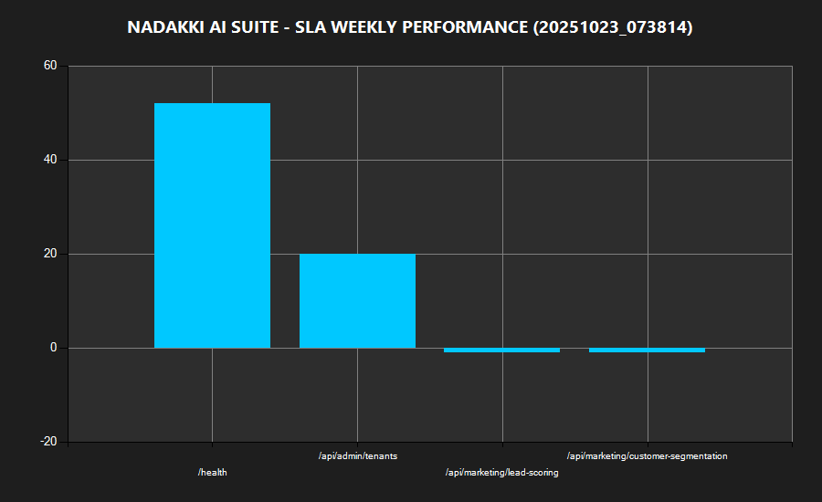

# NADAKKI AI SUITE - SEMANAL SLA SUMMARY (W)
**Fecha:** 10/23/2025 07:38:15
**Promedio General:** 17.48 ms  
**Total Endpoints:** 4

| Endpoint | Promedio (ms) | Mínimo | Máximo | Muestras |
|-----------|---------------|--------|---------|-----------|| /health | 51.91 | 51.91 | 51.91 | 2 |
| /api/admin/tenants | 20 | 20 | 20 | 2 |
| /api/marketing/lead-scoring | -1 | -1 | -1 | 2 |
| /api/marketing/customer-segmentation | -1 | -1 | -1 | 2 |

